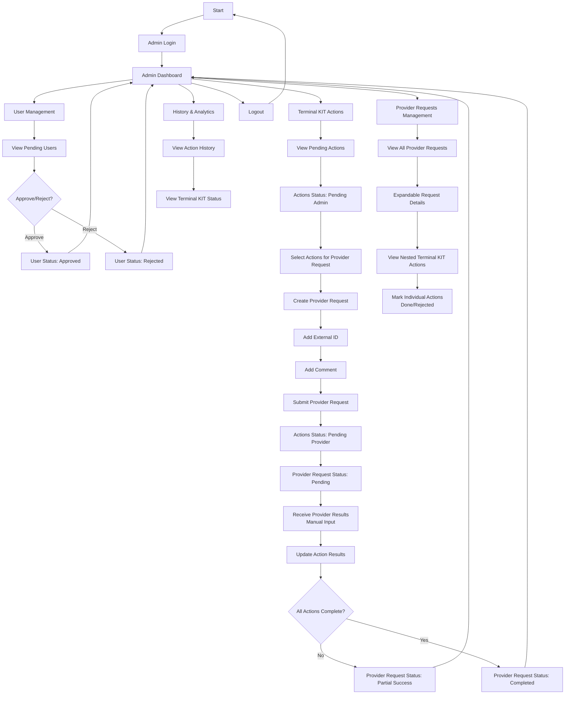

# Admin Flow Diagram

## Admin Journey Description

1. **Authentication**: Admins login to access admin dashboard
2. **User Management**: Approve or reject pending user registrations
3. **Action Processing**: Review pending Terminal KIT actions from clients
4. **Provider Request Creation**: Select multiple actions and create provider requests
5. **Result Processing**: Manually input provider responses and update action statuses
6. **Request Monitoring**: Track provider request progress and individual action completion

## Key Admin Responsibilities

- **User Approval**: Review and approve/reject new user registrations
- **Action Review**: Examine pending Terminal KIT actions
- **Provider Coordination**: Create and manage provider requests
- **Result Processing**: Update system with provider responses
- **Status Tracking**: Monitor completion of all actions within requests

## Admin Dashboard Sections

- **Pending Users**: User registration approvals
- **Pending Actions**: Terminal KIT actions awaiting provider requests
- **Provider Requests**: Active requests with expandable action details
- **History**: Complete audit trail of all actions and requests</content>
<parameter name="filePath">/home/artmisis/projects/starshield/docs/admin-flow.md