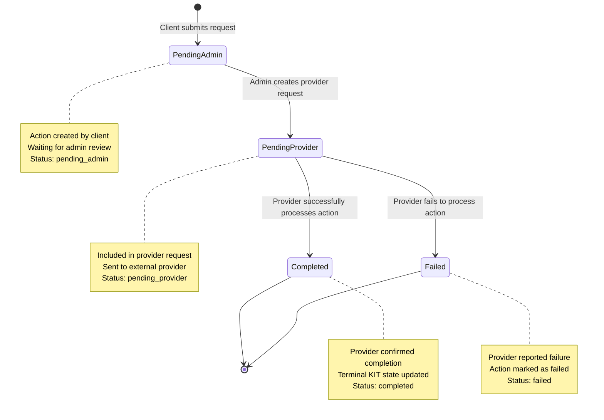

# ID Actions Status Flow Diagram

## Action Status Transitions

### Status Definitions

- **Pending Admin** (`pending_admin`): Action created by client, awaiting admin review and inclusion in provider request
- **Pending Provider** (`pending_provider`): Action included in provider request, sent to external provider for processing
- **Completed** (`completed`): Provider successfully processed the action, Terminal KIT state updated
- **Failed** (`failed`): Provider reported failure or error in processing the action

### Transition Triggers

1. **Client → Pending Admin**: When client submits a request with Terminal KIT actions
2. **Pending Admin → Pending Provider**: When admin selects actions and creates a provider request
3. **Pending Provider → Completed**: When provider successfully processes the action (manual input by admin)
4. **Pending Provider → Failed**: When provider reports failure or error (manual input by admin)

### Action Types

Each action can be one of:
- **Activate**: Change Terminal KIT from any state to `active`
- **Deactivate Temp**: Change Terminal KIT from `active` to `deactivated_temp`
- **Deactivate Perm**: Change Terminal KIT from any state to `deactivated_perm`

### Provider Request Context

- Multiple actions can be grouped into a single provider request
- Each provider request has its own status tracking
- Actions within a request can complete independently
- Provider request status depends on completion of all contained actions</content>
<parameter name="filePath">/home/artmisis/projects/starshield/docs/id-actions-status-flow.md