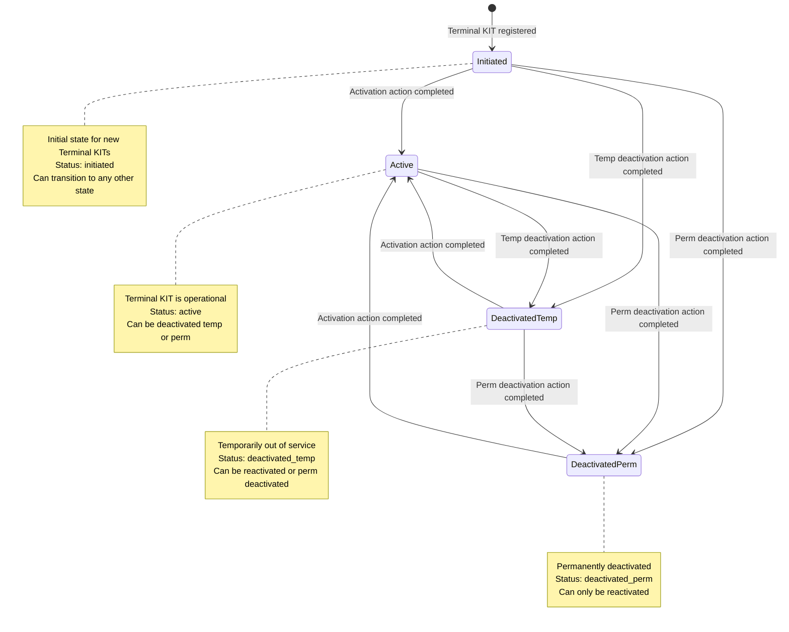

# Terminal Status Flow Diagram

## Terminal KIT State Transitions

### State Definitions

- **Initiated** (`initiated`): Initial state for newly registered Terminal KITs
- **Active** (`active`): Terminal KIT is operational and available for use
- **Deactivated Temp** (`deactivated_temp`): Terminal KIT is temporarily out of service
- **Deactivated Perm** (`deactivated_perm`): Terminal KIT is permanently deactivated

### Allowed Transitions

| From State | To States | Trigger |
|------------|-----------|---------|
| Initiated | Active, Deactivated Temp, Deactivated Perm | Client request → Provider action |
| Active | Deactivated Temp, Deactivated Perm | Client request → Provider action |
| Deactivated Temp | Active, Deactivated Perm | Client request → Provider action |
| Deactivated Perm | Active | Client request → Provider action |

### Action Types and State Changes

- **Activate**: Any state → `active`
- **Deactivate Temp**: `active` → `deactivated_temp`
- **Deactivate Perm**: Any state → `deactivated_perm`

### Business Rules

1. **Initiated State**: Starting point for all new Terminal KITs, allows transition to any operational state
2. **Active State**: Normal operational state, can only be deactivated
3. **Temporary Deactivation**: Reversible state, can return to active or become permanent
4. **Permanent Deactivation**: Terminal state, can only be reactivated (not temp deactivated)

### State Persistence

- States are stored in the `terminal_kits` table (`current_state` column)
- State changes are recorded in `terminal_kit_actions` table with `previous_state` and `resulting_state`
- All state transitions require successful provider action completion</content>
<parameter name="filePath">/home/artmisis/projects/starshield/docs/terminal-status-flow.md