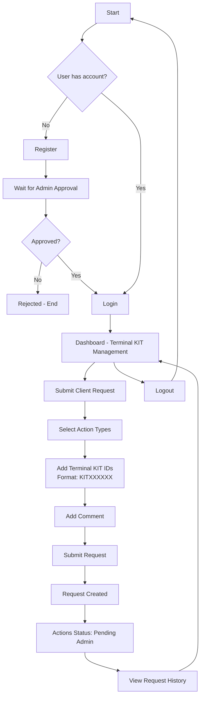

# User Flow Diagram

## User Journey Description

1. **Registration**: New users register and wait for admin approval
2. **Authentication**: Approved users can login to access the system
3. **Request Submission**: Users can submit requests for Terminal KIT actions:
   - Activation requests
   - Temporary deactivation
   - Permanent deactivation
4. **Request Tracking**: Users can view their request history and current status
5. **Status Updates**: Actions move from "Pending Admin" to "Pending Provider" to "Completed"

## Key User Actions

- **Register**: Create new account
- **Login**: Authenticate with email/password
- **Submit Request**: Create new Terminal KIT action requests
- **View History**: Check status of submitted requests
- **Logout**: End session</content>
<parameter name="filePath">/home/artmisis/projects/starshield/docs/user-flow.md